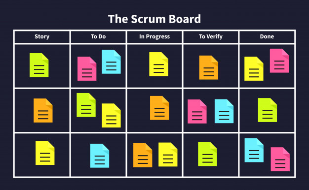

## SCRUM

Scrum é um framework de gestão ágil para projetos que tem como foco atender as pequenas equipes, onde a cultura de entrega, evolução, colaboração e transparência fazem parte da essência do time. 

Esta metodologia, tem como objetivo alinhar e organizar as diversas tarefas a serem desempenhadas pelo time, criando um fluxo de entrega contínua, fragmentando atividades grandes de complexidade alta em pequenas que continuam agregando valor a cada entrega. Tal frequência é de suma importância, pois a medida em que são realizadas, o usuário(cliente) poderá deixar seu feedback, testando a nova funcionalidade de seu produto e guiando assim o caminho do time para que seja possível agregar a maior quantidade possível de valor ao produto final.

## Benefícios da metodologia SCRUM

*Eficácia: Fazer a coisa certa;
*Entregas Constantes;
*Gestão de Tempo;
*Eficiência: Agregar valor ao que se está fazendo;
*Relacionamento com o Usuário: Por se tratar de entregas contínuas, o usuário é uma peça importante para o processo,  isso faz com que o relacionamento e a satisfação com a entrega final sejam sempre positivos, atendendo ao que foi esperado;

### Requisito

Todos os integrantes do time devem saber claramente suas funções e responsabilidades. Este auto conhecimento, é primordial para que as atividades de trabalho fluam de maneira eficaz.

## Funcionamento

### Transparência

No Scrum, todos os participantes são incentivados a expor suas dificuldades com o time. Essa liberdade é mais do que bem-vinda neste framework, pois assim o time consegue se ajudar, entendendo o obstáculo do colaborador e o auxiliando com a solução do mesmo de maneira ágil.

### P.O.

Product Owner é basicamente a visão do cliente dentro da sprint. Ele será o profissional responsável por entender claramente as necessidades do usuário, transmitindo tais informações para seu time e definindo prioridades.
###Devs

Existem literaturas que definem Devs como todos que participam do processo, porém também é normal escutar que estes profissionais são aqueles que possuem características multidisciplinares e que realizam rotinas definidas no planejamento, como: Programador, QA, DBA, Arquiteto, Engenheiro…

### Scrum Master

Este profissional atuará como manager. Sua responsabilidade é basicamente garantir que todos entendam o funcionamento teórico e prático deste método para que os objetivos da scrum sejam alcançados, intermediando conflitos e direcionando o time para resolução de possíveis impedimentos. 

## O que é a tal Agilidade?

Agilidade é a capacidade de realizar entregas contínuas que agregam valor ao produto em um período curto de tempo.

Para conseguir êxito nessa arte, explicando de maneira grosseira, o P.O. deverá escutar e documentar todos os requisitos e metas do software, assim organizando-os em histórias. 

Após isso, ocorre a sprint planning (reunião de planejamento). Todo o time se reúne para discutir de estimular tempo/complexidade para realização de cada requisito. 

 As histórias(requisitos) de grande complexidade são quebradas em menores. Desta forma gerando um fluxo que possibilita a execução dessas tasks dentro do período planejado para cada sprints. “DESENVOLVIMENTO EM FATIAS”.
 

## Sprint

Evento pertencente ao Scrum, no qual reúne uma quantidade de atividades a serem entregues dentro do timebox estipulado na sprint planning.

## Time Box

Time Box é o tempo planejado e que deverá ser respeitado para realização de cada atividade da sprint, sendo ela uma sprint, sprint planning, daily scrum, sprint review ou sprint retrospective.

* Sprint == 4 semanas ou menos
* Sprint Planning == 8h ou menos
* Daily Scrum == 15 min ou menos
* Sprint Review == 4h ou menos
* Sprint Retrospective == 3h ou menos

### Sprint Planning

Tempo de planejamento para decidir o que estará dentro da sprint;

### Daily Scrum

Reunião diária onde é abordado o que foi feito no dia anterior, o que será feito hoje e as dificuldades/impedimentos enfrentados;

### Sprint Review

Meeting onde os desenvolvedores mostram o que está no estágio de “pronto”.

Mas qual seria a definição de PRONTO?

#### Pronto

Pronto é processo que um determinado item deverá percorrer desde o início até o momento que é considerado pronto para ser mostrado ao cliente. A Definição de Pronto varia de projeto para projeto, de time para time, de momento em momento do projeto. Exemplos de Definições de Pronto são:

Desenvolvido + Testado Manualmente
Análise + Desenvolvimento + Em homologação
Teste de aceitação + desenvolvimento + code review + aprovação

### Sprint Retrospective

Sprint para se debater pontos a serem melhorados da sprint passada para próxima sprint.
Exemplo: Seria interessante que o P.O. participasse mais da Daily.

## Product Backlog
Lista hierarquizada de requisitos que mais agregam valor ao usuário. Esta lista é desenvolvida pelo P.O. durante sua conversa com o cliente para entender suas necessidades.

